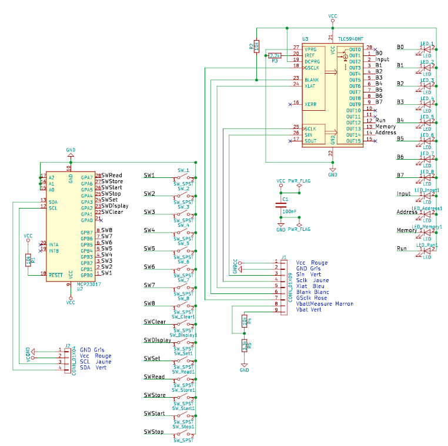

Kenbak-1 Replica
================
Replica of the [Kenbak-1](http://kenbak-1.net): the first personnal computer.

All the internal TTL logic has been replaced by an Arduino Nano.
An MCP23017 handle the inputs.
An TLC5940NT handle the LEDs.

Differences with the original
-----------------------------
* Useful shortcuts (see below).
* Memory initialized to 0.
* Unprecise timing (original Kenbak-1 instructions had an unknown number of cycles).

Publications
------------
If you want to learn more about the computer, here are some publications taken from the [Kenbak-1's original website](http://kenbak-1.net/index_files/page0008.htm):

* [Programming Reference Manual](assets/publications/ProgrammingReferenceManual.pdf): everything you need to program the computer.
* [Laboratory Exercises](assets/publications/LaboratoryExercises.pdf): to learn how to use the computer, how to handle binary numbers, how to make algorithms and flowcharts… Awesome book, I read it completely (that's how passionate I am about this computer) and filled it so if you need some answers or look at sample programs assemblies I made, look here: [Programming Reference Manual Completed](assets/publications/LaboratoryExercisesCompleted.pdf).
* [Theory of Operation](assets/publications/TheoryOfOperation.pdf): all electronic schematics to understand the inner workings of the Kenbak-1.

Compilation
-----------
You will need [PlatformIO](http://platformio.org/) (first time I use it in a project, amazing tool).

* To compile: `$ pio run`.
* To upload: `$ pio run -t upload`.

Shortcuts
---------
* STOP + START: As the original Kenbak-1, executes one instruction.
* STOP + READ: Load RAM n°X. X is determined by the input number entered on the Kenbak-1 (input register: memory address 0377). Programs 0-3 come from the Arduino's EEPROM, others from the Arduino's Flash ([sample programs](src/samplePrograms.cpp)).
* STOP + STORE: Store RAM in EEPROM bank n°X. Only numbers 0-3 are allowed.
* STOP + CLEAR: Clear all RAM (initialized to 0).
* STOP + DISPLAY: Dump RAM to serial if `DEBUG` is defined (config.h)[src/config.h] in a C-array friendly manner. I use this so I can enter a program from the Kenbak-1 and then save it as a [sample program](src/samplePrograms.cpp).
* STOP + B0-B7: Change LEDs' brightness.

Sample programs
---------------
0-3. User saved programs (EEPROM)

You can find listing and instructions for the following programs in the [Laboratory Exercices completed by myself](assets/publications/LaboratoryExercisesCompleted.pdf).

4. Automatic counter (*[Laboratory Exercises][LabExer]* Exercise 2, page 2-3 and almost Exercise 12, page 12-5)
5. Step-by-step counter (*[Laboratory Exercises][LabExer]* Exercise 3, page 3-1)
6. Binary to decimal training (*[Laboratory Exercises][LabExer]* Exercise 4, page 4-3)
7. Decimal to binary training (*[Laboratory Exercises][LabExer]* Exercise 5, page 5-1)
8. Adder (*[Laboratory Exercises][LabExer]* Exercise 6, page 6-1)
9. Combination lock, code is 42 (*[Laboratory Exercises][LabExer]* Exercise 11, page 11-7)
10. Separate tallies (*[Laboratory Exercises][LabExer]* Exercise 13, page 13-4)
11. Sum of consecutive values in memory (*[Laboratory Exercises][LabExer]* Exercise 14, page 14-6, preloaded with values given page 14-4)
12. Substraction (*[Laboratory Exercises][LabExer]* Exercise 15, page 15-4)
13. Two numbers adder by consecutive increments (*[Laboratory Exercises][LabExer]* Exercise 15, page 15-5)

You can find listing and instructions for the following custom programs in the [samplePrograms folder](assets/samplePrograms).

14. K-2000: simple animation of an LED going back and forth.
15. Multiplier: push START to start, enter first term, push START, enter second term, push START, results displays, push START to start again.
16. [Pong](assets/samplePrograms/16-Pong.md): very simple Pong. Push START to begin. When the ball is at the far left, press the bit 7 button at the same time to try to launch it back to the right.

TODO
----
* Put sample programs in Arduino's flash memory!
* Update and upload schematics, PCB, 3D model, GCode and everything.
* Use MCP23017 interrupts.
* Use internal timer to check battery's voltage every X sec.
* Uniformize `switch`s and `if`s in `exec()`.

Quirks
------
* *[Laboratory Exercises][LabExer]* page 13-4: instruction `STORE A (200)` should be `STORE A OUTPUT`.

[LabExer]: assets/publications/LaboratoryExercises.pdf